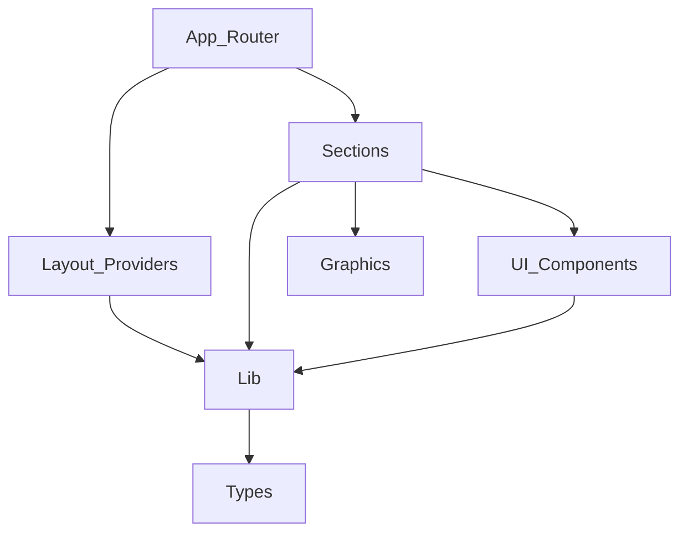

## Stack
- Next.js 15 (App Router, Turbopack), React 19, TypeScript 5 (package.json)
- Tailwind CSS v4 (postcss.config.mjs, package.json devDependencies)
- Animation: GSAP 3.15 + @gsap/react, Motion (Framer Motion) 12, Lenis smooth scroll (package.json dependencies)
- Static export deploy to GitHub Pages via .github/workflows/deploy.yml (README.md)

## Directory map
| path | what lives there |
| --- | --- |
| src/app | routes (Server Components): page.tsx, layout.tsx, about/, contact/, services/, sitemap.ts, robots.ts, not-found.tsx |
| src/app/about, /contact, /services | one page.tsx per route |
| src/components/layout | Header.tsx, Footer.tsx, MobileNav.tsx |
| src/components/providers | SmoothScrollProvider.tsx (Lenis on GSAP ticker) |
| src/components/sections | home/, about/, contact/, services/ — one component per page section |
| src/components/ui | Reveal, GlassCard, SectionHeading, MagneticButton, Marquee, BackToTop |
| src/components/graphics | hand-built SVG: BlueprintTower, Skyline, ServiceOrbit, IndiaDotMap, MeshBlobs, GridBeams, Icon, LogoMark |
| src/lib | data.ts, animations.ts, gsap.ts, utils.ts, hooks/ |
| src/lib/hooks | usePrefersReducedMotion.ts |
| src/types | content.ts (typed content interfaces) |

## Diagram

## Component index
- [[App_Router]]
- [[Layout_Providers]]
- [[Sections]]
- [[UI_Components]]
- [[Graphics]]
- [[Lib]]
- [[Types]]

## Entry points
- Dev: `next dev --turbopack`, root route src/app/page.tsx via src/app/layout.tsx (package.json, src/app/layout.tsx)
- Prod: `next build --turbopack` then `next start`; static export config referenced in next.config.ts per README.md (not opened — respecting whitelist)

## Conventions
- Server Components by default for every page.tsx/layout.tsx; `'use client'` confined to animation leaves (README.md)
- Heaviest client scenes (StatsScene, ServicesRail) code-split with `next/dynamic` in src/app/page.tsx
- All copy/content centralized in src/lib/data.ts behind typed interfaces from src/types/content.ts (README.md)
- Shared motion vocabulary (easing/duration/stagger) in src/lib/animations.ts (README.md)
- Sections organized per-route under src/components/sections/<route>/

## Where things go
- To add a new route: add src/app/<route>/page.tsx, add matching section components under src/components/sections/<route>/
- To add new page content/copy: extend src/lib/data.ts and its types in src/types/content.ts
- To add a new shared UI primitive: src/components/ui/
- To add a new hand-built graphic: src/components/graphics/
- To change shared motion timing: src/lib/animations.ts and src/lib/gsap.ts
